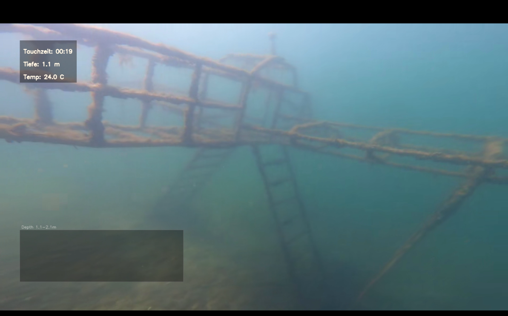

# Dive Data Overlay (Rust)

Overlays dive-computer CSV telemetry (depth, temperature, pressure, heart rate, dive time) onto video. Supports multiple clips with gaps, per-clip sync points, and automatic sync via each MP4's recording time.

A Rust workspace that shells out to `ffmpeg`/`ffprobe` (no OpenCV/libav linking).



## Output modes

- **Overlay** (default): values burned directly into the video pixels.
- **Subtitles**: values written as a soft subtitle track (SRT/`mov_text`), toggleable on/off in the player. Video/audio are copied losslessly (no re-encode); an `.srt` sidecar is also written.

## Requirements

- Rust (stable, 2021 edition) via [rustup](https://rustup.rs/)
- `ffmpeg` and `ffprobe` on PATH (e.g. `winget install Gyan.FFmpeg` on Windows)

## Building & testing

```bash
cargo build --release
cargo test --workspace
```

Binaries land in `target/release/dive_overlay_cli(.exe)` and `target/release/dive_overlay_gui(.exe)`.

## Workspace layout

- `crates/dive_overlay_core` — CSV parsing, sample lookup, overlay drawing, ffprobe wrapper, ffmpeg pipeline, multi-clip/auto-sync
- `crates/dive_overlay_cli` — CLI binary (clap)
- `crates/dive_overlay_gui` — GUI binary (egui/eframe)

## CSV format

Column names are recognized flexibly, e.g. `sample time (min)`, `sample depth (m)`, `sample temperature (C)`, `sample pressure (bar)`, `sample heartrate` (see `dive.csv` for a sample file). Use `--column-map` to override auto-detection.

## Usage

### GUI

```bash
cargo run --release --bin dive_overlay_gui
```

Select a CSV (with an optional "Interpolate between samples" toggle next to Browse), set fields, choose a mode and codec/preset/hardware acceleration, add clips, preview and fine-tune sync, then start processing. Progress (%, fps, active encoder) is shown live and can be cancelled at any time.

### CLI — single clip

```bash
cargo run --release --bin dive_overlay_cli -- \
  --csv dive.csv --video input.mp4 \
  --video-sync-sec 3.2 --csv-sync-mmss 0:10
```

Produces `input_overlay.mp4`. Add `--mode subtitles` for the subtitle variant, or `--codec hevc --hw-accel` for hardware-accelerated encoding.

### CLI — multiple clips (with gaps)

Each clip gets its own sync point: `video_path|video_sync_sec|csv_sync_mmss[|output_path]`.

```bash
cargo run --release --bin dive_overlay_cli -- \
  --csv dive.csv --fields time,depth,temp \
  --clip "clip1.mp4|2.1|0:10|clip1_overlay.mp4" \
  --clip "clip2.mp4|0.8|18:35|clip2_overlay.mp4" \
  --clip "clip3.mp4|5.0|31:20"
```

If `output_path` is omitted, `<video_stem>_overlay.mp4` is used.

### CLI — automatic sync

Instead of syncing every clip manually, sync one base clip and let the rest be derived from each MP4's recording time (`creation_time` via `ffprobe`):

```bash
cargo run --release --bin dive_overlay_cli -- \
  --csv dive.csv \
  --clip "clip1.mp4|0|0:00" --clip "clip2.mp4|0|0:00" \
  --auto-sync --base-clip clip1.mp4 \
  --base-video-sync-sec 0 --base-csv-datetime "2025-07-05 10:00:00"
```

`video_sync_sec` is assumed identical across clips (e.g. "film the dive computer for the first few seconds of every clip") — only `csv_sync_sec` is shifted per clip. Requires a date and time column in the CSV.

## Sync explained

`--video-sync-sec` is the point in the video (seconds) where the dive computer is filmed as a reference; `--csv-sync-mmss` is the dive time shown at that exact moment. E.g. if the computer reads `0:10` at `3.2s` into the video: `--video-sync-sec 3.2 --csv-sync-mmss 0:10`.

## Options reference

| Flag | Description |
| --- | --- |
| `--output out.mp4` | Custom output filename |
| `--fields time,depth,temp,pressure,hr` | Which values are displayed |
| `--column-map time=TIME,depth=Depth` | Manual CSV column mapping |
| `--clip "video\|video_sync\|csv_sync[\|out]"` | Repeatable, for multi-clip jobs |
| `--codec auto\|avc1\|H264\|hevc\|H265\|mp4v\|XVID\|MJPG` | Video codec (overlay mode only); `auto`/`H264`/`avc1` → `libx264`, `hevc`/`H265` → `libx265` |
| `--preset ultrafast…placebo` | H264/H265 encoder preset (speed vs. compression), default `veryfast` |
| `--hw-accel` | Hardware encoding (Intel Quick Sync or NVIDIA NVENC) for H264/H265, falling back to software automatically; the actual encoder used is printed/shown |
| `--show-graph` | Small depth-profile graph (overlay mode only) |
| `--interpolate` | Linearly interpolates field values between samples instead of carrying the last known reading forward |
| `--mode overlay\|subtitles` | See [Output modes](#output-modes) above |
| `--auto-sync`, `--base-clip`, `--base-video-sync-sec`, `--base-csv-datetime` | Automatic sync, see above |

Allowed fields: `time`, `depth`, `temp`, `pressure`, `hr`.

## Notes

- If no CSV time has been reached yet at the start of the video, only the dive time is shown.
- Missing CSV values (e.g. temperature in individual rows) are skipped automatically.
- By default the last known measurement is carried forward (stable for typical 10s logging intervals); `--interpolate` linearly interpolates between samples instead.
- The original audio track is preserved (AAC, 192 kbit/s), if present.
- In subtitle mode, whether the embedded track can be toggled on/off depends on the player/container — the `.srt` sidecar can also be loaded separately.
