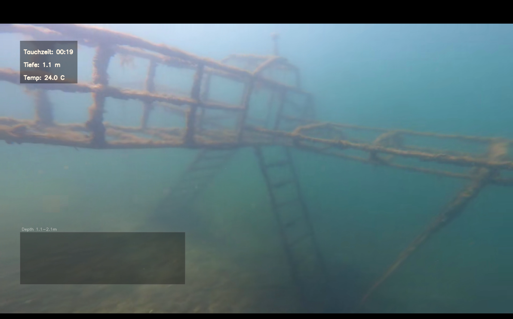

# Dive Data Overlay

Overlays dive-computer CSV telemetry (depth, temperature, pressure, heart rate, dive time) onto video. Supports multiple clips with gaps, per-clip sync points, automatic sync via each MP4's recording time, and combining all of a dive's clips into one video.



## Output modes

- **Overlay** (default): values burned directly into the video pixels.
- **Subtitles**: values written as a soft subtitle track (SRT/`mov_text`), toggleable on/off in the player. Video/audio are copied losslessly (no re-encode); an `.srt` sidecar is also written.

## Requirements

- Rust (stable, 2021 edition) via [rustup](https://rustup.rs/)
- `ffmpeg` and `ffprobe` on PATH (e.g. `winget install Gyan.FFmpeg` on Windows)

## Building & testing

```bash
cargo build --release
cargo test --workspace
```

Binaries land in `target/release/dive_overlay_cli(.exe)` and `target/release/dive_overlay_gui(.exe)`.

## Workspace layout

- `crates/dive_overlay_core` — CSV parsing, sample lookup, overlay drawing, ffprobe wrapper, ffmpeg pipeline, multi-clip/auto-sync
- `crates/dive_overlay_cli` — CLI binary (clap)
- `crates/dive_overlay_gui` — GUI binary (egui/eframe)

## CSV format

Column names are recognized flexibly, e.g. `sample time (min)`, `sample depth (m)`, `sample temperature (C)`, `sample pressure (bar)`, `sample heartrate` (see `dive.csv` for a sample file). Use `--column-map` to override auto-detection.

## Usage

### GUI

```bash
cargo run --release --bin dive_overlay_gui
```

Select a CSV , set fields, choose a mode and codec/preset/hardware acceleration, add clips, find each clip's sync point, then start processing.

**Sync preview** (select a clip → *Sync preview*) walks the two steps in order:

1. The `-1 min … +1 min` buttons scrub the **video sync point** and re-seek the clip. Use them to land on the frame where the dive computer is readable; the readout shows the position and the clip length, and scrubbing stops at both ends of the video.
2. Type the dive time the computer reads in that frame into the **CSV sync** field. The overlay redraws as you type, so you can check it against what's on screen — if the two agree, the clip is synced.

Two checkboxes handle multi-clip dives:

- **Combine all clips into one dive video** — same behavior as `--merge-output` below: clips are sorted by dive time, joined back-to-back, and only the combined file is kept.
- **Auto-sync clips from their recording timestamps** — the GUI equivalent of `--auto-sync`: pick a base clip, enter its video sync second and the CSV date/time at that moment, and every other clip's sync is derived from how much later it started recording.

### CLI — single clip

```bash
cargo run --release --bin dive_overlay_cli -- \
  --csv dive.csv --video input.mp4 \
  --video-sync-sec 3.2 --csv-sync-mmss 0:10
```

Produces `input_overlay.mp4`. Add `--mode subtitles` for the subtitle variant, or `--codec hevc --hw-accel` for hardware-accelerated encoding.

### CLI — multiple clips (with gaps)

Each clip gets its own sync point: `video_path|video_sync_sec|csv_sync_mmss[|output_path]`.

```bash
cargo run --release --bin dive_overlay_cli -- \
  --csv dive.csv --fields time,depth,temp \
  --clip "clip1.mp4|2.1|0:10|clip1_overlay.mp4" \
  --clip "clip2.mp4|0.8|18:35|clip2_overlay.mp4" \
  --clip "clip3.mp4|5.0|31:20"
```

If `output_path` is omitted, `<video_stem>_overlay.mp4` is used.

### CLI — automatic sync

Instead of syncing every clip manually, sync one base clip and let the rest be derived from each MP4's recording time (`creation_time` via `ffprobe`):

```bash
cargo run --release --bin dive_overlay_cli -- \
  --csv dive.csv \
  --clip "clip1.mp4|0|0:00" --clip "clip2.mp4|0|0:00" \
  --auto-sync --base-clip clip1.mp4 \
  --base-video-sync-sec 0 --base-csv-datetime "2025-07-05 10:00:00"
```

`video_sync_sec` is assumed identical across clips (e.g. "film the dive computer for the first few seconds of every clip") — only `csv_sync_sec` is shifted per clip. Requires a date and time column in the CSV.

### CLI — one dive, one file

A dive usually arrives as several clips from the same CSV. `--merge-output` combines them into a single video:

```bash
cargo run --release --bin dive_overlay_cli -- \
  --csv dive.csv \
  --clip "clip3.mp4|0|31:20" --clip "clip1.mp4|0|0:10" --clip "clip2.mp4|0|18:35" \
  --merge-output dive_full.mp4
```

- Clips are sorted by **dive time**, not by the order you listed them — the example above still comes out as clip1 → clip2 → clip3.
- They are joined back-to-back with **no filler** for the surface intervals between them, so the overlay's dive time jumps at each seam (`12:30` → `18:35`). That's an honest rendering of footage that doesn't exist.
- Only the combined file is kept. The per-clip results are written to a `<output_stem>_parts/` scratch directory and deleted once the merge succeeds; if a clip fails or you cancel, the parts are left behind and the message says where.
- Clips that share resolution, frame rate and audio are joined losslessly (stream copy). Mismatched ones are re-encoded into the largest clip's frame, with silence synthesized for any clip without audio.
- In subtitle mode the embedded `mov_text` track comes along and the `.srt` sidecar is rebuilt on the merged timeline. Mismatched clips are rejected there rather than re-encoded, since that mode exists precisely to avoid touching pixels.

Combining works with `--auto-sync` too, which is the usual pairing: sync one base clip by hand and get one finished dive video out.

## Sync explained

`--video-sync-sec` is the point in the video (seconds) where the dive computer is filmed as a reference; `--csv-sync-mmss` is the dive time shown at that exact moment. E.g. if the computer reads `0:10` at `3.2s` into the video: `--video-sync-sec 3.2 --csv-sync-mmss 0:10`.

## Options reference

| Flag | Description |
| --- | --- |
| `--output out.mp4` | Custom output filename |
| `--fields time,depth,temp,pressure,hr` | Which values are displayed |
| `--column-map time=TIME,depth=Depth` | Manual CSV column mapping (keys: `time`, `depth`, `temp`, `pressure`, `hr`, plus `date`/`clock` for the wall-clock columns auto-sync reads) |
| `--clip "video\|video_sync\|csv_sync[\|out]"` | Repeatable, for multi-clip jobs |
| `--merge-output dive_full.mp4` | Combine every clip into this one dive video, see above |
| `--codec auto\|avc1\|H264\|hevc\|H265\|mp4v\|XVID\|MJPG` | Video codec (overlay mode only); `auto`/`H264`/`avc1` → `libx264`, `hevc`/`H265` → `libx265` |
| `--preset ultrafast…placebo` | H264/H265 encoder preset (speed vs. compression), default `veryfast` |
| `--hw-accel` | Hardware encoding (Intel Quick Sync, NVIDIA NVENC, or AMD AMF) for H264/H265, falling back to software automatically; the actual encoder used is printed/shown |
| `--show-graph` | Small depth-profile graph (overlay mode only) |
| `--interpolate` | Smoothly interpolates field values between samples (cubic spline) instead of carrying the last known reading forward |
| `--mode overlay\|subtitles` | See [Output modes](#output-modes) above |
| `--auto-sync`, `--base-clip`, `--base-video-sync-sec`, `--base-csv-datetime` | Automatic sync, see above |

Allowed fields: `time`, `depth`, `temp`, `pressure`, `hr`.

## Notes

- If no CSV time has been reached yet at the start of the video, only the dive time is shown.
- Missing CSV values (e.g. temperature in individual rows) are skipped automatically.
- By default the last known measurement is carried forward.
- The original audio track is preserved , if present.
